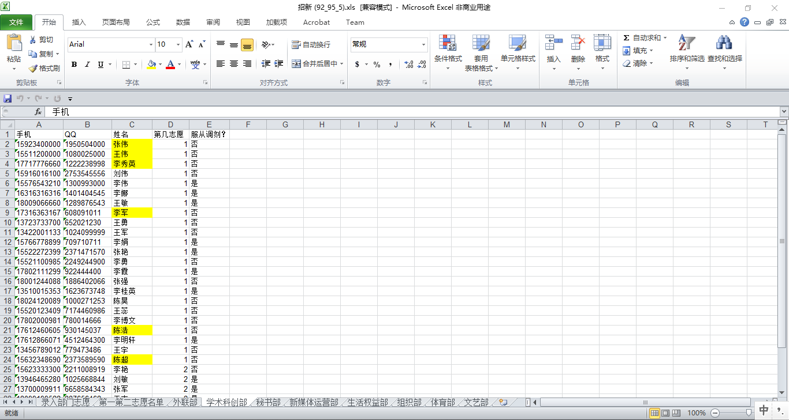

# 学生会自动化招新系统 Recruitment System for SU

这是学生会招新系统, 可以自动化生成各部门名单, 并可突出强调对某部门特别感兴趣的萌新. This is the recuritment system of Students' Union, which can generate a xls roster automatically in a short time, and can highlight the person who is especially interested in a particular department.

本系统最初用于华南理工大学物理与光电学院团委学生会的招新, 可推广到一般学生会的招新程序, 将招新工作搬到云端, 更加智能化.

## 目的:

传统的通过纸质报名表招新的流程一般是: 上午9:00-12:00宣讲 -> 12:00宣讲结束之时把申请表回收 -> 人工统计萌新的第一第二志愿并发短信通知萌新面试时间 -> 下午14:30开始面试, 萌新把申请表交给面试自己的部门主管. 这样做的劣势在于:

1. 对萌新, 做决定的时间过短. 因为需要在仅仅三个小时同时完成, 去哪个部门 & 如何在申请表中向心仪的部门介绍最好的自己, 这两件事. 实际上后者可以让萌新在宣讲会结束后, 吃了午饭, 慢慢琢磨如何写, 并不需要完成得如此匆忙. (要知道宣讲现场, 除了团委学生会, 还有阳光青年志愿者协会和数模电子协会, 这物院的三大组织. 所以做决定还是比较重要的.)

2. 对组织管理者 (即团学各部门和主席团), 很明显的, 在12:00-14:30那么短的时间 (而且还是饭点和午休时间) 内人工统计萌新的第一第二志愿并发短信通知萌新面试时间, 这需要大量的人力并且要避免统计出错. 这是很不明智的. 如果像2016年以及之前的招新那样, 不提前收集申请表, 那么招新数据对组织管理者自己都不透明, 更是不可取的.

本招新系统的目的就在于改善这个问题. 采用纸质申请表和线上申请表 (线上问卷) 结合的方法. 线上问卷只需要萌新填写联系方式和第一第二志愿选哪个部门并是否服从调剂等信息, 并不需要写个人简介, 如图:

    

从后台导出问卷结果并采用本招新系统的小程序一键生成名单只需要不到一分钟的时间, 所以并不需要到12:00截止填写, 可以给萌新预留多一点时间, 譬如12:30截止填写 (即使问卷处于发布态也可以导出结果, 随时导出结果都可以). 生成的xls文件如图

    

    

12:00-14:30的时间让萌新慢慢琢磨如何写申请表和准备面试, 或者休息. 组织管理者所需要做的仅仅是基于生成的xls文件, 发信息通知萌新的面试时间.

## 使用说明:

1. 在 www.wjx.cn 问卷星上制作好问卷 (对应于本招新系统的问卷请联系我), 到点截止填写, 后台下载xls问卷结果: 登录 -> 定位到发布的问卷 -> 分析 & 下载 -> 下载原始答卷 -> 下载答卷数据 -> **按选项序号下载**. 文件名字叫95_92_2.xls (2017年9月招17级萌新的时候是叫这名字, 后来问卷星改版, 问卷结果的文件名含有中文字符 "16548846_2_17级团学招新报名_97_94.xls", 但程序也兼容中文字符)
2. 请将 "团学招新.exe" 跟 "95_92_2.xls" 放在同一个文件夹里.
3. 点击 "团学招新.exe", 输入xls文件的文件名, **切勿包含扩展名**! 如 "95_92_2.xls" 这个文件, 输入95_92_2就好了. (即使文件名含有中文字符以及空格也不影响小程序运行.) **若操作系统提示该exe是未知发布者有风险, 请忽略.**
4. 回车, 一键生成'招新.xls'.

## 亮点

1. 从后台导出问卷结果并采用本招新系统的小程序一键生成名单只需要不到一分钟的时间.
2. 采用学号追踪, 以最后一次的问卷提交为准. 考虑到有人重名 (但学号肯定是不同的), 有人会重复填写 (可能是由于不慎填错或者想要放弃重填或者想用多个手机号QQ号来申请多个部门等等), 以学号追踪重复的问卷提交是可行的.
3. 加入了highlight, 把那些第一第二志愿填了同一个部门而且还不服从调剂的萌新highlight起来, 以便部长和主管可以在面试时给予special care.
4. 后面诸表开列了各applicants的手机, QQ, 志愿信息, 方便部门主管在面试前发送短信通知面试时间.

## 一点提醒

问卷星上可编辑的问卷我是不介意给的, 但不建议轻易改动, 因为问卷跟程序是相关的, 如果问卷被改动, 程序也对应要改动, 并且要通过测试才能发布. 所以除了本系统的开发人员以外, 不建议对问卷进行比较trivial的操作, 譬如说更改选项顺序, 除非你愿意看懂Recruitment.py文件的代码 (虽然不难). 如果团学或班级有架构变动, 可以联系我, 或自己fork一个并提交个更改的commit.
